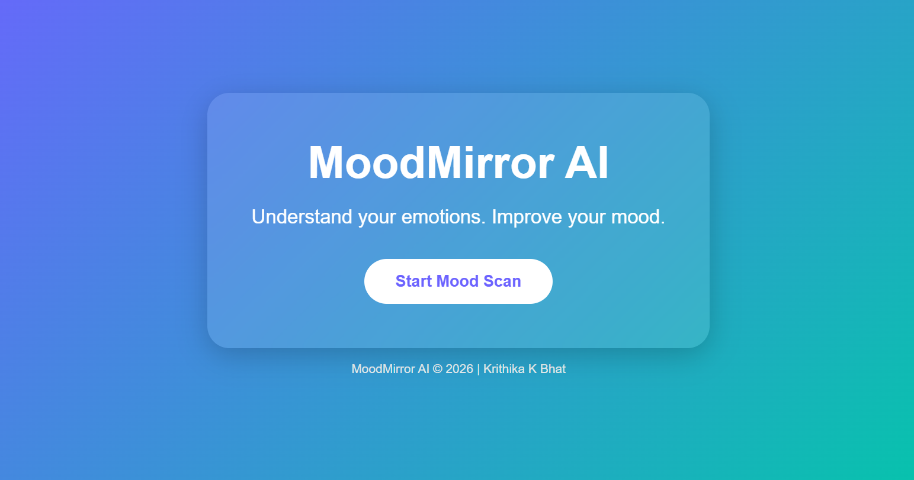
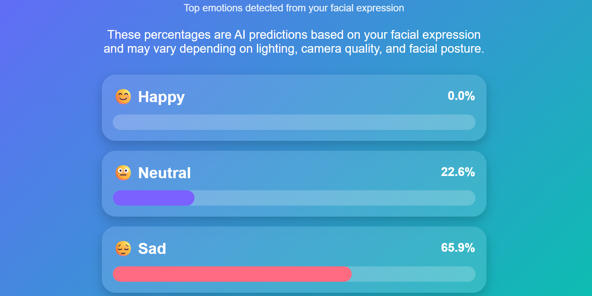
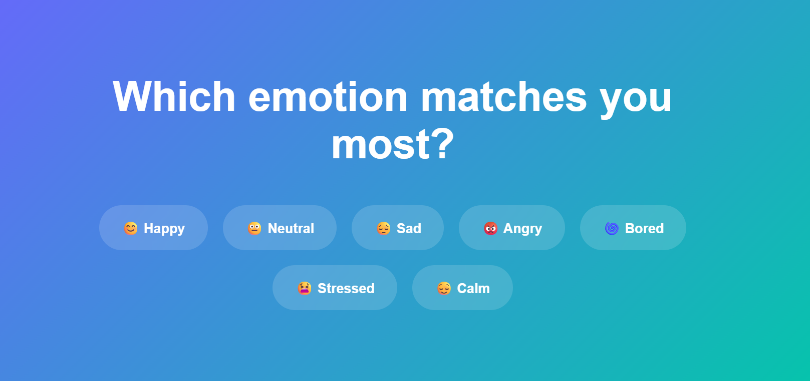

# MoodMirror AI 
MoodMirror AI is a web-based emotion detection application that uses AI to analyze facial expressions through a webcam and identify the user's mood.

The project captures an image from the user's webcam, sends it to a Python backend, and uses DeepFace to detect emotions such as happiness, sadness, neutrality, and more. The results are then displayed as mood percentages in a simple and interactive interface.

## Features
- Real-time webcam access
- AI-powered facial emotion detection
- Emotion percentage breakdown
- Interactive and user-friendly interface
- Cloud deployment for public access

## Tech Stack
### Frontend
- HTML
- CSS
- JavaScript

### Backend
- Python
- Flask
- Flask-CORS

### AI
- DeepFace

### Deployment
- Vercel
- Render

## Project Workflow
1. User opens MoodMirror AI.
2. Webcam captures the user's face.
3. Image is sent to the Flask backend.
4. DeepFace analyzes facial expressions.
5. Emotion scores are generated.
6. Results are displayed visually on the website.

## Live Demo

https://moodmirror-ai.vercel.app

## Screenshots

## Screenshots

### Home Page

### Mood Scan Results

### Confirm Page

## What I Learned
Through this project, I gained practical experience in:
- AI integration in web applications
- Frontend and backend communication
- API development using Flask
- Cloud deployment using Vercel and Render
- Working with Git and GitHub

## Future Improvements
- Faster emotion analysis
- Better UI/UX
- Emotion history tracking
- Personalized mood recommendations
- Additional emotion categories

## Author
**Krithika K Bhat**

BCA Student  
Dayananda Sagar Business Academy
